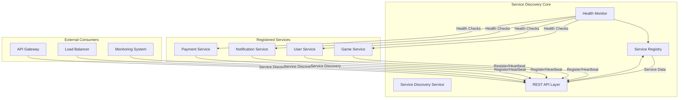

# Service Discovery

* **Core responsibility:** Centralized service registry and health monitoring system that enables services to register themselves, discover other services, and maintain health status across the distributed Mafia Platform ecosystem.

## Tech Stack

* **Framework/Language:** Python 3.13 with FastAPI - chosen for its high performance, automatic API documentation, and excellent async support for handling concurrent service registrations and health checks
* **Database:** In-memory storage using Python dictionaries and asyncio locks - provides ultra-fast read/write performance for service discovery operations while maintaining thread safety
* **Other:** 
  - Pydantic for data validation and serialization
  - HTTPX for async HTTP client operations
  - Uvicorn as ASGI server
  - Docker for containerization
* **Communication pattern:** RESTful HTTP APIs with Bearer token authentication for internal service communication, supporting both synchronous and asynchronous service discovery patterns

## Service Diagram



## Schema

```python
from enum import Enum
from datetime import datetime
from typing import Dict, Optional, List
from dataclasses import dataclass, field

class ServiceStatus(str, Enum):
    HEALTHY = "healthy"
    UNHEALTHY = "unhealthy"
    UNKNOWN = "unknown"

@dataclass
class ServiceInstance:
    service_name: str
    instance_id: str
    host: str
    port: int
    health_endpoint: str
    status: ServiceStatus = ServiceStatus.UNKNOWN
    last_health_check: Optional[datetime] = None
    last_heartbeat: Optional[datetime] = None
    load_percentage: float = 0.0
    metadata: Dict[str, str] = field(default_factory=dict)
    registered_at: datetime = field(default_factory=datetime.now)

class ServiceRegistrationRequest(BaseModel):
    service_name: str
    instance_id: str
    host: str
    port: int
    health_endpoint: str = "/health"
    metadata: Dict[str, str] = Field(default_factory=dict)

class ServiceHeartbeatRequest(BaseModel):
    service_name: str
    instance_id: str

class HealthCheckResult(BaseModel):
    status: str
    service: str
    timestamp: str
    uptime_seconds: float
    load_percentage: float
    custom_checks: Optional[Dict[str, Any]] = None
```

## Endpoints

### Service Registration & Management

#### `POST /v1/discovery/register` - Register a new service instance

**Request Body:**
```json
{
    "service_name": "game-service",
    "instance_id": "game-1",
    "host": "localhost",
    "port": 8080,
    "health_endpoint": "/health",
    "metadata": {
        "version": "1.0.0",
        "environment": "production"
    }
}
```

**Response:**
```json
{
    "success": true,
    "message": "Service game-service:game-1 registered successfully"
}
```

#### `POST /v1/discovery/heartbeat` - Update service heartbeat

**Request Body:**
```json
{
    "service_name": "game-service",
    "instance_id": "game-1"
}
```

**Response:**
```json
{
    "success": true,
    "message": "Heartbeat updated successfully"
}
```

#### `DELETE /v1/discovery/unregister/{service_name}/{instance_id}` - Unregister service instance

**Path Params:**
1. `service_name: string` - Name of the service to unregister
2. `instance_id: string` - ID of the specific instance to unregister

**Response:**
```json
{
    "success": true,
    "message": "Service unregistered successfully"
}
```

### Service Discovery

#### `GET /v1/discovery/services` - Retrieve all registered services

**Response:**
```json
{
    "services": {
        "game-service": [
            {
                "service_name": "game-service",
                "instance_id": "game-1",
                "host": "localhost",
                "port": 8080,
                "health_endpoint": "/health",
                "status": "healthy",
                "last_health_check": "2024-01-15T10:30:00Z",
                "last_heartbeat": "2024-01-15T10:29:45Z",
                "load_percentage": 0.3,
                "metadata": {"version": "1.0.0"},
                "registered_at": "2024-01-15T10:00:00Z"
            }
        ]
    }
}
```

#### `GET /v1/discovery/services/{service_name}` - Retrieve instances of a specific service

**Path Params:**
1. `service_name: string` - Name of the service to retrieve instances for

**Response:**
```json
{
    "service_name": "game-service",
    "instances": [
        {
            "service_name": "game-service",
            "instance_id": "game-1",
            "host": "localhost",
            "port": 8080,
            "status": "healthy",
            "load_percentage": 0.3
        }
    ]
}
```

#### `GET /v1/discovery/services/{service_name}/healthy` - Retrieve only healthy instances

**Path Params:**
1. `service_name: string` - Name of the service to retrieve healthy instances for

**Response:**
```json
{
    "service_name": "game-service",
    "healthy_instances": [
        {
            "service_name": "game-service",
            "instance_id": "game-1",
            "host": "localhost",
            "port": 8080,
            "status": "healthy",
            "load_percentage": 0.3
        }
    ]
}
```

#### `GET /v1/discovery/services/{service_name}/instances` - Retrieve instances in Prometheus format

**Path Params:**
1. `service_name: string` - Name of the service to retrieve Prometheus targets for

**Response:**
```json
[
    {
        "targets": ["localhost:8080"],
        "labels": {
            "instance": "game-1",
            "service_name": "game-service",
            "status": "healthy",
            "load_percentage": "0.3",
            "version": "1.0.0"
        }
    }
]
```

### Health & Monitoring

#### `GET /health` - Service discovery health check

**Response:**
```json
{
    "status": "healthy",
    "service": "service-discovery",
    "load_percentage": 0.0
}
```

## Dependencies

The Service Discovery service has **no external dependencies** - it operates as a standalone service that other services depend on. However, it provides integration points for:

### Service Integration

Services can integrate with Service Discovery using the provided client library:

```python
from service_discovery import ServiceDiscoveryClient, ServiceRegistrationRequest

# Initialize client
client = ServiceDiscoveryClient(
    service_discovery_url="http://service-discovery:3004",
    service_discovery_secret="your-secret-key"
)

# Register service
service_request = ServiceRegistrationRequest(
    service_name="my-service",
    instance_id="instance-1",
    host="localhost",
    port=8080,
    health_endpoint="/health",
    metadata={"version": "1.0.0"}
)

await client.register_service(service_request)

# Start heartbeat loop
await client.start_heartbeat_loop(interval_seconds=60)

# Discover other services
game_services = await client.discover_services("game-service", healthy_only=True)
```

### Health Check Implementation

Services should implement a health check endpoint that returns:

```python
from service_discovery import HealthChecker, setup_service_health_checks

# Setup health checks in your FastAPI app
health_checker = setup_service_health_checks(
    app=app,
    service_name="my-service",
    db_client=db_client,  # Optional
    external_services={"payment-api": "https://payment.example.com"}  # Optional
)
```

### Configuration

Environment variables for service integration:

- `SERVICE_DISCOVERY_URL` - URL of the service discovery service (default: `http://service-discovery:3004`)
- `SERVICE_DISCOVERY_SECRET` - Secret key for authentication
- `SERVICE_HEARTBEAT_INTERVAL` - Heartbeat interval in seconds (default: 60)

### Docker Integration

```yaml
# docker-compose.yml
services:
  my-service:
    build: .
    environment:
      - SERVICE_DISCOVERY_URL=http://service-discovery:3004
      - SERVICE_DISCOVERY_SECRET=your-secret-key
    depends_on:
      - service-discovery
    networks:
      - mafia-platform

  service-discovery:
    build: ./service-discovery
    ports:
      - "3004:3004"
    networks:
      - mafia-platform
```

The Service Discovery service enables the entire Mafia Platform ecosystem to operate as a cohesive, self-healing distributed system where services can dynamically discover and communicate with each other while maintaining optimal health and performance.
